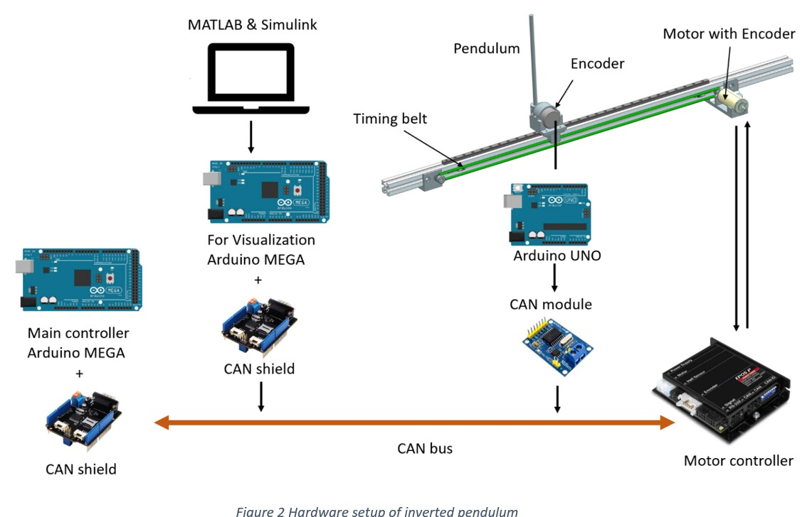
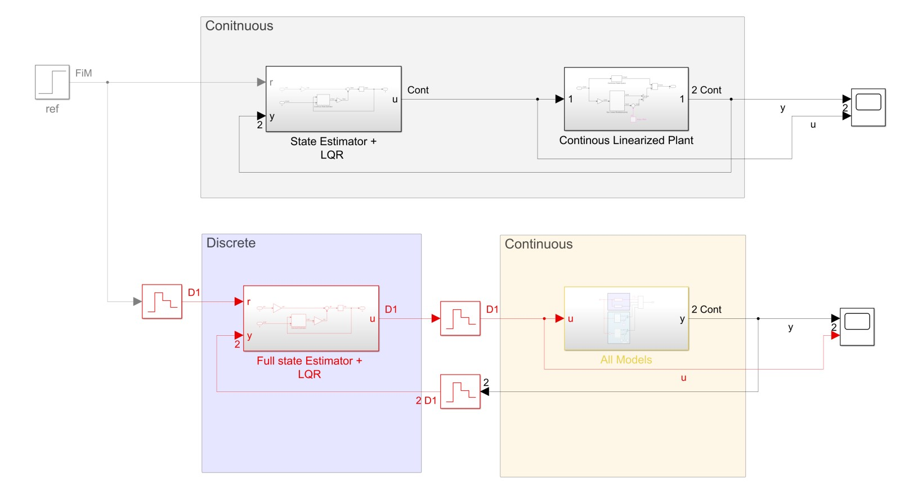
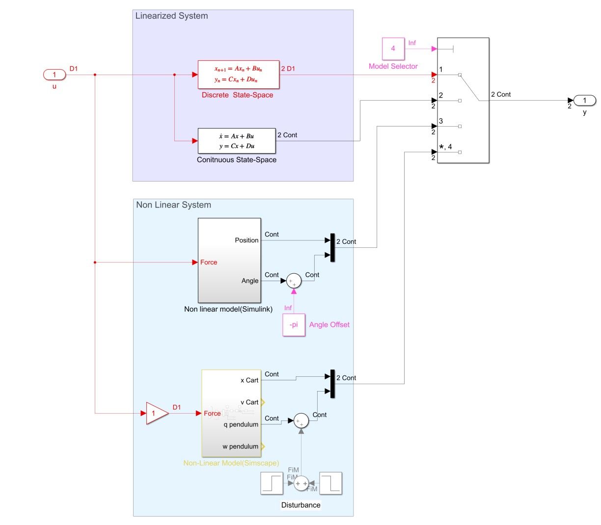
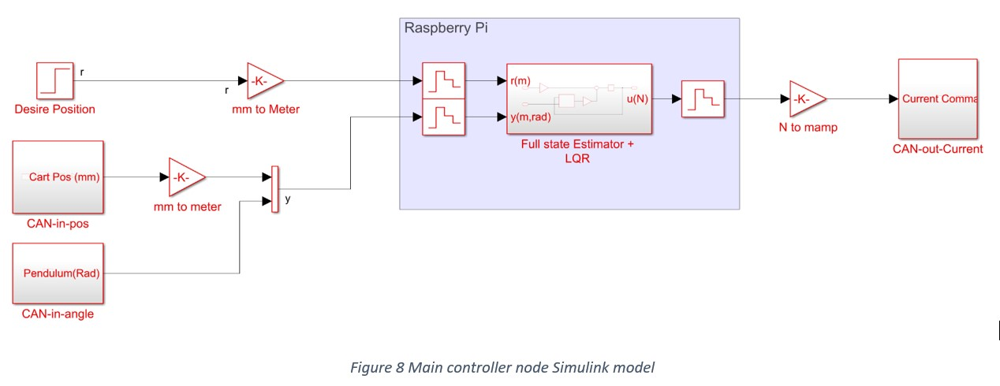

# Inverted_Pendulum




Checkout Documentation.docx for more details 

## Controller Design
File: models/main_code.m
Change necessary details as explained in the comments and run the matlab file to load the parameters into the workspace.

simulink models can access the workspace so when you run simulation model or Controller model to upload code onto the Arduinos is can use these parameters.

## Full System Simulation 
File: Model/Full_Sys_Sim.slx



use this model to test controller before deploying to Arduino.

**Note**: this simulation doesnt include dynamics of motor or belt pulley, so it won't be realistic.



use Model Selector box to chose model to run,
1. Linearized Discrete state-space
2. Linearized Continous state-space
3. Non Linear Continous Model (Simulink)
4. Non Linear Continous Model (Simscape)


## scope
File: model/scope_can_read.slx

COM port to 8 
Arduino Mega, CAN spi ss pin changed to 9 for seed studio CAN shield

CAN interrupt pin 2

## Main controller



### Duo
File: models/Duo_Controller.slx (moved to duo)

### Mega
File: models/Controller.slx 
## Encoder arduino
CAN/CAN_Send.ino

## Errors combining controller and scope (don't try again)
error:External Mode Open Protocol Connect command failed
tried: External mode serial insted XPC serial didn't work

maybe because Encoder arduino keep sending messages and causing the interrupt to trigger

error:
```
The following error occurred during deployment to your hardware board: 
Could not connect to specified Arduino board. 

Verify that the board is connected to your host, and that the host COM port number set in the model matches the COM port number in Windows. 

To change the host COM port number in the model, click 'Simulation ', click 'Model Configuration Parameters'... In the dialog that opens, select the 'Hardware Implementation' pane, click 'Target hardware resources > Host-board connection' and set the COM port number. 

To find out the COM port number in Windows, open Device Manager and open your board in the COM ports group.
```
tried: keep host board COM automatic not sure if it worked
tried: unplug replug